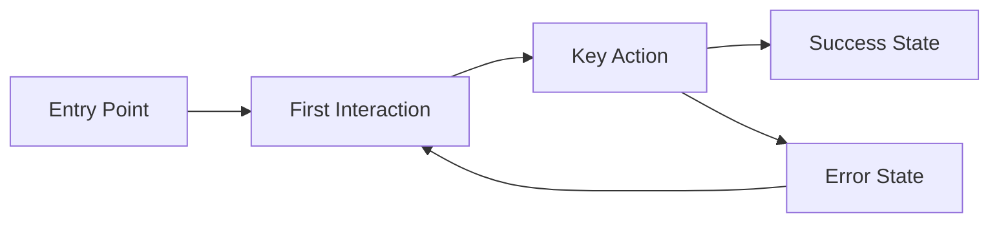

# Design Brief: [Project Name]

## Executive Summary
[2-3 sentences capturing the design vision and goals]

## Project Context
**Product Goal**: [Main objective from project spec]
**Target Launch**: [Timeline/deadline]
**Platform Priority**: [Desktop-first | Mobile-first | Responsive]
**Design Phase**: [Concept | Wireframes | High-fidelity | Implementation]

## Brand & Identity
### Brand Values
- [Value 1]: [How it translates to design]
- [Value 2]: [How it translates to design]
- [Value 3]: [How it translates to design]

### Visual Personality
[Select 3-5 that best represent the desired feel]
- [ ] Clean & Minimal
- [ ] Bold & Modern
- [ ] Warm & Friendly
- [ ] Professional & Trustworthy
- [ ] Playful & Engaging
- [ ] Sophisticated & Premium
- [ ] Tech-Forward & Innovative
- [ ] Approachable & Human
- [ ] Data-Rich & Informative
- [ ] Cutting-Edge & Futuristic

## User Research & Personas

### Primary Persona: [Name]
- **Demographics**: [Age range, profession, tech-savvy level]
- **Goals**: [What they want to achieve]
- **Pain Points**: [Current frustrations]
- **Success Looks Like**: [Desired outcome]
- **Design Implications**: [How this affects design decisions]

### Secondary Persona: [Name]
- **Demographics**: [Details]
- **Goals**: [What they want to achieve]
- **Pain Points**: [Current frustrations]
- **Success Looks Like**: [Desired outcome]
- **Design Implications**: [How this affects design decisions]

## Design Principles
1. **[Principle Name]**: [Description and how it guides decisions]
2. **[Principle Name]**: [Description and how it guides decisions]
3. **[Principle Name]**: [Description and how it guides decisions]
4. **[Principle Name]**: [Description and how it guides decisions]

## User Journey Maps

### Core User Flow


### Detailed Journey: [Feature Name]
**Scenario**: [User context and goal]

| Stage | Touchpoint | User Actions | Thoughts/Feelings | Opportunities |
|-------|------------|--------------|-------------------|---------------|
| Awareness | [Where] | [What they do] | [Emotional state] | [Design opportunity] |
| Consideration | [Where] | [What they do] | [Emotional state] | [Design opportunity] |
| Action | [Where] | [What they do] | [Emotional state] | [Design opportunity] |
| Success | [Where] | [What they do] | [Emotional state] | [Design opportunity] |

## Information Architecture

### Site Map
```
Home
├── [Section 1]
│   ├── [Page]
│   └── [Page]
├── [Section 2]
│   ├── [Page]
│   └── [Page]
└── [Section 3]
    └── [Page]
```

### Screen Inventory
**Priority 1 - MVP**
1. [Screen Name]: [Purpose and key elements]
2. [Screen Name]: [Purpose and key elements]
3. [Screen Name]: [Purpose and key elements]

**Priority 2 - Post-MVP**
1. [Screen Name]: [Purpose and key elements]
2. [Screen Name]: [Purpose and key elements]

## Visual Design Direction

### Mood Board Themes
[Describe 2-3 visual directions to explore]

**Direction 1: [Name]**
- Keywords: [3-5 descriptive words]
- Color feeling: [Description]
- Typography style: [Description]
- Imagery approach: [Description]

**Direction 2: [Name]**
- Keywords: [3-5 descriptive words]
- Color feeling: [Description]
- Typography style: [Description]
- Imagery approach: [Description]

### Component Requirements
**Data Display**
- Tables: [Requirements]
- Charts: [Types needed]
- Cards: [Information types]

**User Input**
- Forms: [Complexity level]
- Search: [Functionality needed]
- Filters: [Types required]

**Feedback**
- Success states: [Requirements]
- Error states: [Requirements]
- Loading states: [Requirements]
- Empty states: [Requirements]

**Navigation**
- Primary nav: [Pattern]
- Secondary nav: [Pattern]
- Mobile nav: [Approach]

## Technical Constraints
**Frontend Framework**: [e.g., React with specific UI library]
**CSS Approach**: [e.g., Tailwind CSS]
**Browser Support**: [Requirements]
**Device Support**: [Breakpoints and requirements]
**Performance Budget**: 
- First Contentful Paint: < [X]s
- Time to Interactive: < [X]s
- Lighthouse Score: > [X]

**Accessibility Requirements**:
- WCAG compliance level: [2.1 AA/AAA]
- Screen reader support
- Keyboard navigation
- Color contrast requirements

## Success Metrics
**Usability Metrics**
- Task completion rate: > [X]%
- Error rate: < [X]%
- Time on task: < [X] seconds
- User satisfaction: > [X]/5

**Business Metrics**
- [Specific metric]: [Target]
- [Specific metric]: [Target]

**Design System Metrics**
- Component reuse rate: > [X]%
- Design-dev handoff time: < [X] days
- Consistency score: > [X]%

## Design Deliverables

### Phase 1: Foundation
- [ ] Design principles documentation
- [ ] Mood boards and visual exploration
- [ ] Color palette and typography system
- [ ] Component library foundation
- [ ] Design tokens specification

### Phase 2: Core Screens
- [ ] Wireframes for all Priority 1 screens
- [ ] High-fidelity mockups
- [ ] Interactive prototype
- [ ] Responsive layouts (mobile, tablet, desktop)
- [ ] State variations (empty, loading, error, success)

### Phase 3: Design System
- [ ] Complete component library
- [ ] Design system documentation
- [ ] Interaction patterns guide
- [ ] Accessibility annotations
- [ ] Developer handoff specifications

## Out of Scope
[List what is explicitly NOT included in this design phase]
- [Feature/element]
- [Feature/element]
- [Feature/element]

## References & Inspiration
- [Link to competitor or inspiration]
- [Link to design pattern]
- [Link to relevant case study]

## Appendix
### Competitive Analysis
[Brief analysis of 2-3 competitors]

### Technical Specifications
[Any specific technical requirements that impact design]

### Glossary
[Define any project-specific terms]

---
**Document Status**: [Draft | In Review | Approved]
**Last Updated**: [Date]
**Next Review**: [Date]